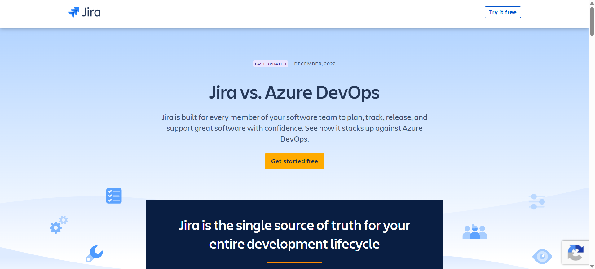

# Microsoft Azure Research

## Brief Overview

Microsoft Azure is a cloud computing platform developed by Microsoft. It provides services for computing, storage, networking, databases, security, artificial intelligence, and business applications.

## Global Infrastructure

Azure provides cloud regions around the world. An Azure region consists of physical facilities containing datacenters and networking infrastructure. Azure has more than 70 regions globally.

## Cloud Management Console

The Azure portal is a web-based management interface used to create and manage Azure resources and services.

## Four Core Services

1. **Azure Virtual Machines** – Provides virtual machines for running applications.
2. **Azure Blob Storage** – Stores files and other unstructured data.
3. **Azure Virtual Network** – Provides private networking for Azure resources.
4. **Microsoft Entra ID** – Provides identity and access management.

## Three Advantages

1. Azure works well with Microsoft technologies.
2. Azure provides a large global infrastructure.
3. Azure provides many enterprise-focused cloud services.

## Typical Enterprise Use Cases

Azure can be used by businesses and schools for Windows servers, Microsoft 365 integration, applications, databases, storage, networking, and identity management.

## Screenshot

Insert your screenshot of the Azure homepage or Azure portal here.

## Source

Microsoft Azure Documentation: https://learn.microsoft.com/azure/
