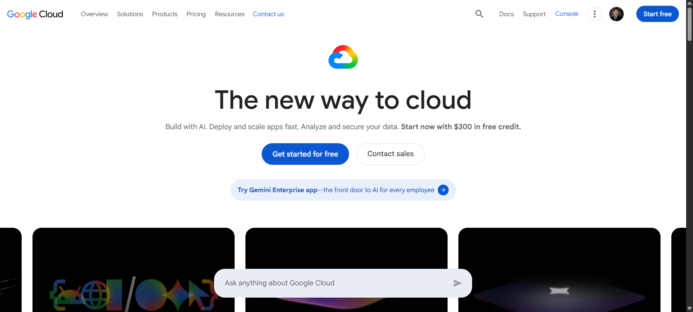

# Google Cloud Platform Research

## Brief Overview

Google Cloud Platform (GCP) is Google's cloud computing platform. It provides services for computing, storage, networking, databases, artificial intelligence, machine learning, and Kubernetes.

## Global Infrastructure

Google Cloud organizes its infrastructure into regions and zones. Regions are geographic areas that contain zones, allowing organizations to choose locations based on latency, availability, and durability requirements.

## Cloud Management Console

Google Cloud Console is a web-based interface used to manage Google Cloud projects, services, resources, and settings.

## Four Core Services

1. **Compute Engine** – Provides virtual machines.
2. **Cloud Storage** – Provides object storage.
3. **Google Kubernetes Engine (GKE)** – Provides managed Kubernetes.
4. **Cloud IAM** – Controls access to Google Cloud resources.

Google Cloud IAM can also be used to control access to GKE resources and clusters.

## Three Advantages

1. GCP is strong in artificial intelligence and machine learning.
2. GCP provides strong Kubernetes support.
3. GCP has a global cloud infrastructure.

## Typical Enterprise Use Cases

GCP can be used for artificial intelligence, machine learning, data analytics, websites, mobile applications, containerized applications, and Kubernetes deployments.

## Screenshot

## Source

Google Cloud Documentation: https://cloud.google.com/docs
